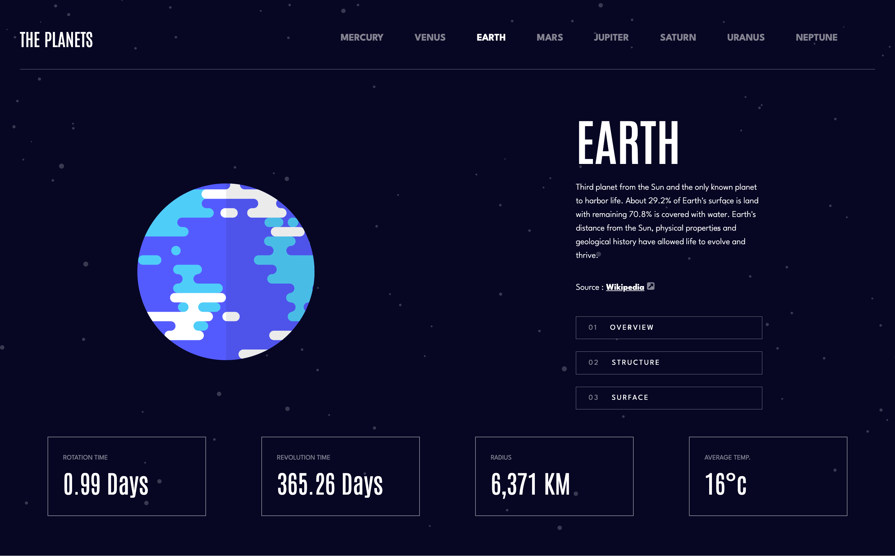

# Frontend Mentor - Planets fact site solution

This is a solution to the [Planets fact site challenge on Frontend Mentor](https://www.frontendmentor.io/challenges/planets-fact-site-gazqN8w_f). Frontend Mentor challenges help you improve your coding skills by building realistic projects.

## Table of contents

- [Overview](#overview)
  - [The challenge](#the-challenge)
  - [Screenshot](#screenshot)
  - [Links](#links)
- [My process](#my-process)
  - [Built with](#built-with)
  - [What I learned](#what-i-learned)
  - [Continued development](#continued-development)
  - [Useful resources](#useful-resources)
- [Author](#author)

## Overview

### The challenge

Users should be able to:

- View the optimal layout for the app depending on their device's screen size
- See hover states for all interactive elements on the page
- View each planet page and toggle between "Overview", "Internal Structure", and "Surface Geology"

### Screenshot



### Links

- Solution URL: [GitHub Repository](https://github.com/raulgaliciab/planets-fact-site)
- Live Site URL: [Vercel](https://planets-fact-site-red.vercel.app/)

## My process

### Built with

- [React](https://react.dev/) - JS library
- [React Router](https://reactrouter.com/start/declarative/installation) v7.4.1 - Library
- [SASS](https://sass-lang.com/)
- Mobile-first workflow
- CSS Grid and Flexbox

### What I learned

#### How to use nested routes with React Router

```
export const AppRouter = () => {
  return (
    <Routes>
      <Route path='/' element={ <Home/>} />
      <Route path='/:planetName/*' element={ <PlanetPage />} >
        <Route index element={ <PlanetOverview />} />
        <Route path='overview' element={ <PlanetOverview />}/>
        <Route path='internal-structure' element={ <PlanetStructure />}/>
        <Route path='surface-geology' element={ <PlanetGeology />}/>
      </Route>
    </Routes>
  )
}
```

#### Burger Menu with HTML and CSS

You can create a Burger Menu using an input [type:checkbox] tag, and using the `:checked` pseudo class to change the display when clicked.

```
.menu-planets {
  display: none; // The menu is hidden
}

input {
  background-image: url('/assets/icon-hamburger.svg');
  appearance: none;
  pointer-events: none;
  transition: opacity 200ms ease-in-out;
}

input:checked {
  opacity: 0.5;
}

.burger-icon:has(input:checked) + .menu-planets {
  display: flex; // The menu appears when clicked
}
```

#### Configuration on Vercel deploy

When deploying a Vite and React Router app on Vercel, refreshing the page or accessing a subroute directly may result in a 404 error because the server looks for non-existent files instead of allowing React Router to handle navigation. To fix this, create a vercel.json file in the root with:

```
// vercel.json

{
  "rewrites": [{ "source": "/(.*)", "destination": "/index.html" }]
}
```

### Continued development

- Use of more SASS features
- Vercel config

### Useful resources

- [NavLink](https://api.reactrouter.com/v7/functions/react_router.NavLink.html) - This helped me to learn how to apply an active CSS class on a NavLink element

## Author

- Raúl Galicia
- GitHub - [@raulgaliciab](https://github.com/raulgaliciab)
- Frontend Mentor - [@raulgaliciab](https://www.frontendmentor.io/profile/raulgaliciab)
